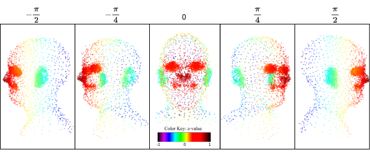
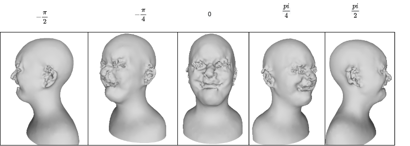
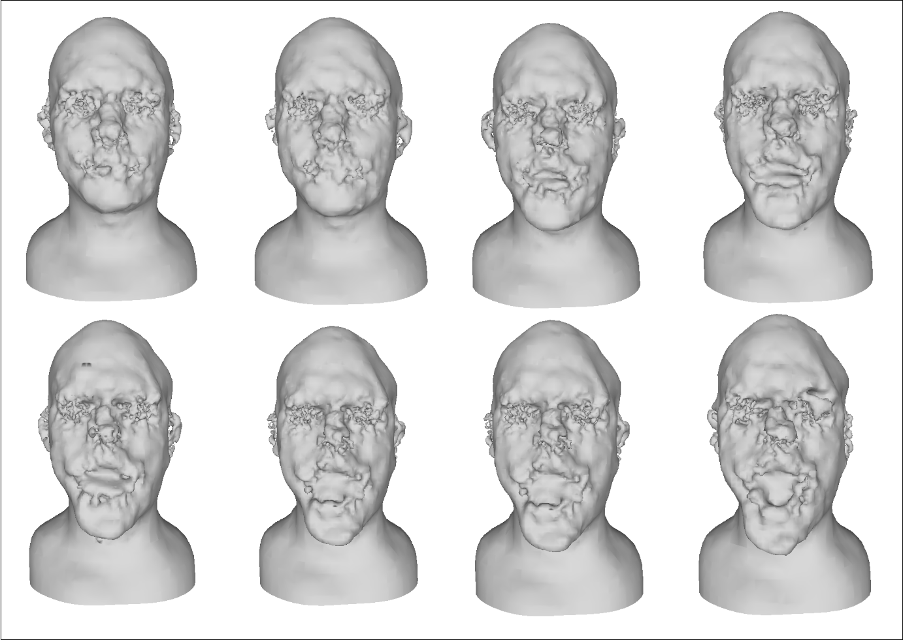

# PCE-GAN
## Introduction
PCE-GAN is a controllable GAN variant that uses a DCGAN based generator and PointNet based classifier for generation of expression controlled point set facial data. 
The method is able to generate recognizable human faces with stable expression manipulation with metrics comparable to state of the art methods.
## Results

### Face synthesis


### Expression Manipulation

## Usage
Anyone may use this code for research purposes or otherwise. If you use this code in your research, please cite the following paper:
```
@misc{PCE-GAN,
    author = {Liam Watson},
    title = {Expression Controllable 3D Point Cloud GAN (PCE-GAN)},
    year = {2022},
}
```
## Requirements
Included in the project is a requirements file that can be used to install the required dependencies.
Alternatively there is an anaconda environment file that can be used to create a conda environment with the required dependencies.

Python 3.7.13 should be used.

## Data
The data used for training and testing is the data introduced by CoMA and can be found at: https://coma.is.tue.mpg.de/download.php

## Structure and file explanation
controllable_gan/ contains the code for the GAN model - training, model and control steps.
pointnet/ contains the code for the PointNet classifier - classifier and model.
qual_assessment_portal/ contains the code for the qualitative assessment portal.
quan_assessment_framework/ contains the code for the quantitative assessment.
simpleDCGAN/ contains the code for the DCGAN model - training, model and control steps.
classifierEval.py is used for evaluating the PointNet classifier.
displayVerticies.py is used for displaying the verticies of a point cloud numpy array containing many faces and can be used to view many saved faces or training/test data in various visualisations.
meshClass.py is a high level wrapper class of open3d functions that makes it easier to work with point clouds.
processData.py is used for processing the data from the CoMA dataset into a format that can be used by the GAN - this is taken from CoMA.
preprocessing/ contains the code for preprocessing the data from the CoMA dataset into a format that can be used by the GAN - this is taken from CoMA.
test.py is used for testing the GAN model.
visualiseFaceSimple.py is used for visualising the included face model.

## Getting started 
### Installation 
You may choose to install dependencies with pip or conda. 
You are assumed to be using a unix based environment. 
`pip3 install -r requirements.txt` or `conda env create -f environment.yml`
Note: Usage may vary depending on GPU and CUDA version.
### Training
#### GAN 
To train the GAN model:
`chmod +x trainPCEGAN.sh`
`./trainPCEGAN.sh` One may choose to modify hyperparameters as arguments in the file. 

#### PointNet
To train the PointNet classifier:
`cd pointnet`
`pip install -e .`
`chmod +x trainscript.sh`
`./trainscript.sh`

### Testing
#### Controlled generation
To generate faces with the GAN model, run `python3 controllable_gan/faceGEN.py <Path to saved generator model>`
You may want to play around with parameters such as learning rate, batch size, eval/train modes/ regularisation (included) etc.
#### PointNet classifier
You will need to change the relative paths in the classifier dataloder - just uncomment lines 166-169.
This is set up for 4 expressions so you will need to make modifications for 2. 
To test the PointNet classifier, run `python3 classifierEval.py`

### Assessment framework
To run the testing framework:
`chmod +x controlGANtest.sh`
`./controlGANtest.sh`
 


